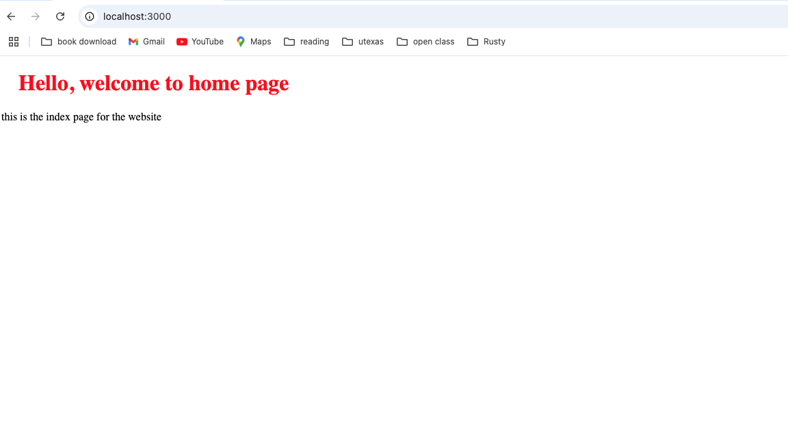

# HTTP Server

A simple HTTP server implementation in Rust that handles basic web requests.

## Description

This project implements a basic HTTP server that:
- Listens on port 3000
- Handles HTTP requests
- Serves responses with appropriate status codes
- Supports basic routing

## Prerequisites

- Rust programming language (latest stable version)
- Cargo (Rust's package manager)

## Installation

1. Clone the repository: 
2. Build the project: `cargo build`
3. Run the server: `cargo run -p httpserver`
4. Run tests: `cargo test -p httpserver`

The server will start running on `localhost:3000` by default.

### Testing the Server

You can test the server using:
- A web browser: Navigate to `http://localhost:3000`
- cURL: `curl http://localhost:3000`
- Any HTTP client of your choice

### Welcome Page Preview
